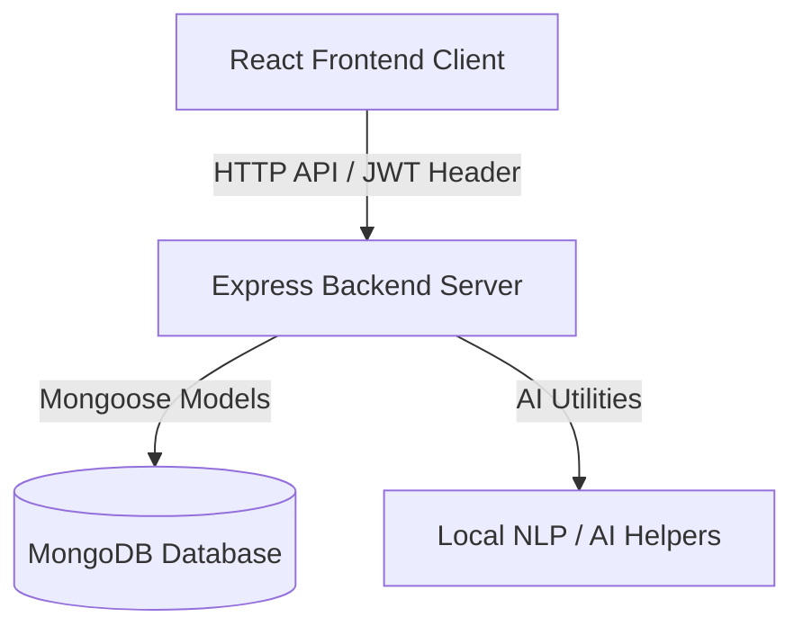

# 🎓 Vicharanashala MERN FAQ Management System

A high-fidelity administrative support desk, community discussion portal, and AI-supported moderation dashboard designed for IIT Ropar interns. Built using the MERN (MongoDB, Express, React, Node.js) stack, styled using **Google Stitch** design principles, and using real token-based secure authentication.

---

## 📋 Table of Contents

- [✨ Features](#-features)
- [🏗️ System Architecture](#️-system-architecture)
- [🛠️ Tech Stack](#️-tech-stack)
- [🚀 Getting Started & Installation](#-getting-started--installation)
  - [Prerequisites](#prerequisites)
  - [1. Clone and Navigate](#1-clone-and-navigate)
  - [2. Backend Setup & Configuration](#2-backend-setup--configuration)
  - [3. Frontend Setup](#3-frontend-setup)
- [🌱 Seeding initial Data](#-seeding-initial-data)
- [🔑 Authentic User Credentials](#-authentic-user-credentials)
  - [Seeded Credentials](#seeded-credentials)
  - [Registering Custom Accounts](#registering-custom-accounts)
- [🖥️ How to Run locally](#️-how-to-run-locally)
  - [Run Backend](#run-backend)
  - [Run Frontend](#run-frontend)
- [🎨 Design Aesthetics](#-design-aesthetics)
- [🛡️ Audit Logging & Telemetry](#️-audit-logging--telemetry)

---

## ✨ Features

1. **Category Management Infrastructure**: Database-driven category system that populates sidebar, grids, and filters dynamically with custom icons and descriptions.
2. **AI-Powered Moderator Tools**: Admin panel equipped with a Jaccard-similarity duplicate question detector and automatic AI-suggested answers to resolve student queries.
3. **MERN Discussion Forum**: Public forums where students can post queries, upvote answers, track views, and reply to each other.
4. **AI Helper Chatbot**: Interactive client-side floating helper query system answering questions based on existing verified FAQs.
5. **Real JWT Authentication**: Secure bcrypt password hashes, Express middleware validation, and React authentication context preserving token state securely in local storage.
6. **Command Palette (`⌘K`)**: Fast access searching dialog matching questions, categories, and site pages dynamically.

---

## 🏗️ System Architecture



---

## 🛠️ Tech Stack

* **Frontend**: React (Vite), Tailwind CSS (v4), React Router DOM, Lucide Icons, Axios.
* **Backend**: Node.js, Express, Mongoose ODM.
* **Database**: MongoDB (Atlas or Local instance).
* **Security**: JWT (JsonWebToken), BcryptJS password encryption.

---

## 🚀 Getting Started & Installation

### Prerequisites
Make sure you have **Node.js** (v18+) and **MongoDB** installed on your system.

---

### 1. Clone and Navigate

Open your terminal and navigate to the project directory:
```bash
cd faq-system
```

---

### 2. Backend Setup & Configuration

1. Navigate to the `backend` folder:
   ```bash
   cd backend
   ```
2. Install the backend dependencies:
   ```bash
   npm install
   ```
3. Create a `.env` file inside the `backend` directory containing the following environment variables:
   ```env
   PORT=5000
   MONGO_URI=mongodb+srv://<username>:<password>@cluster.mongodb.net/faqDB
   JWT_SECRET=your_secure_jwt_secret_token
   ```

---

### 3. Frontend Setup

1. Open a new terminal and navigate to the `frontend` folder:
   ```bash
   cd ../frontend
   ```
2. Install the frontend dependencies:
   ```bash
   npm install
   ```

---

## 🌱 Seeding Initial Data

To seed the database with initial Categories (with unique icons), Admin profiles, Student profiles, FAQs, and Discussions:

1. Navigate to the `backend` directory:
   ```bash
   cd backend
   ```
2. Run the seed script:
   ```bash
   npm run seed
   ```
   *To wipe the database clean first and seed a fresh dataset, run:*
   ```bash
   node seed.js --force
   ```

---

## 🔑 Authentic User Credentials

The application enforces genuine database-level JWT authentication.

### Seeded Credentials
If you seeded the database using `npm run seed`, you can sign in directly using:

* **Administrator Account**:
  * **Email/Username**: `admin@faq.com`
  * **Password**: `admin123`
  * *Accesses: Moderation queue, analytics dashboard, category creation, announcement management, and audit logs.*

* **Student Account**:
  * **Email/Username**: `student1@faq.com`
  * **Password**: `test123`
  * *Accesses: Public FAQ pages, discussion forums, asking questions, upvoting, and replying.*

---

### Registering Custom Accounts

You can register custom accounts by clicking **Get Started** on the login page or navigating to `/register`.
- Complete the form with a username, email, and password.
- Passwords must be at least **6 characters** long.
- Upon successful registration, use your new credentials on the standard login page.

---

## 🖥️ How to Run Locally

You need to run both the backend and frontend servers simultaneously.

### Run Backend
In your backend terminal:
```bash
cd backend
npm start
```
*You should see:* `Server running on port 5000` and `MongoDB connected`.

### Run Frontend
In your frontend terminal:
```bash
cd frontend
npm run dev
```
Open your browser to `http://localhost:5173/` (or the printed port) to use the application.

---

## 🎨 Design Aesthetics

This application is built with a custom architectural look based on **Google Stitch** tokens:
- **Typography**: `Outfit` font for bold headers, `Inter` for clean body copy.
- **Glassmorphism**: Layered cards featuring subtle borders and backdrop blur.
- **Interactive Micro-animations**: Soft hover scale effects and tab transition animations.
- **Dynamic Theme Mode**: Dark mode and light mode tailors backgrounds and text contrasts automatically.

---

## 🛡️ Audit Logging & Telemetry

* **Audit Logs**: Any admin actions (like logging in, approving/rejecting a query, creating announcements, or adding categories) are tracked and displayed in the **Audit** tab of the Admin Panel.
* **Telemetry**: Real-time mock performance metrics (CPU, RAM, API Latency Response) are simulated dynamically on the admin dashboard to mirror professional operational software.
